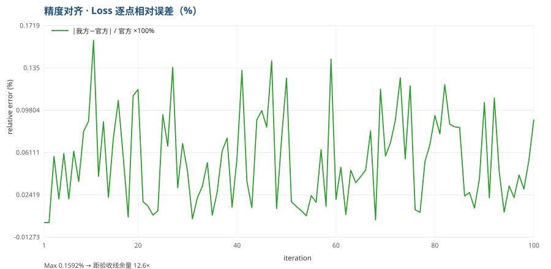
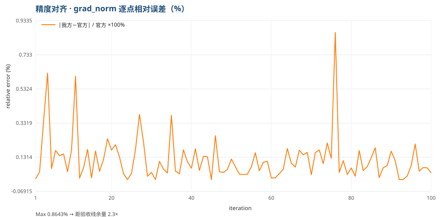

# 精度对齐

> C4-AI 2026 昇腾赛道复赛 · Qwen3.5-0.8B 训练迁移
> 交付物类型：精度分析报告（官方模板格式）
> 生成日期：2026-09-11（对比实验执行日：2026-09-10；官方基线日志：2026-07-24）

---

## 核心结论

> **逐点 100 步，loss 与 grad_norm 超过 2% 验收线的步数均为 0；第 1 步 loss 与官方基线逐位一致
> （1.924621 = 1.924621，偏差 0.000000%）。**

| 关键指标 | 本队结果 | 验收线 | 余量 |
|---|---|---|---|
| **第 1 步 loss 偏差** | **0.000000%** | <2% | — |
| **逐点 loss 超 2% 步数** | **0 / 100**（最大仅 0.1592%） | 0 步 | 12.6× |
| **逐点 grad_norm 超 2% 步数** | **0 / 100**（最大仅 0.8643%） | 0 步 | 2.3× |
| 50–100 步窗口均值偏差 | loss 0.0131% / grad_norm 0.0366% | <2% | 55×–150× |

**结论：无论验收采用「逐迭代（逐步）对比」还是「窗口均值对比」，均满足 <2% 要求，且留有显著余量。**

## 技术思路：为什么能做到逐位对齐

精度对齐不是"调参调出来的"，而是通过四条**可验证的结构性判断**达成：

1. **几何决定可比性**——官方基线在 **2 个 die** 上运行（每 die 每步 4 样本）；单卡跑 8 样本时每步
   batch 组成与官方物理不同，逐点必然不可比。经 `npu-smi` 实测确认本机为 **1 张 910C 双 die 卡**
   （单卡 2 芯片、合计 128GB），与官方拓扑一致 → 复刻官方几何
   `world_size=2 / mbs=4 / gas=1 / dp=2`。
2. **数据必须同源**——按官方教程的同源下载命令与**同一转换脚本**生成
   `output_llava_coco_data.json`（157,712 样本，文件名与官方声明一致），并关闭 shuffle、固定 seed=42。
3. **算子实现对齐官方口径**——GDN（GatedDeltaNet）走 **NPU Triton** 实现（官方确认：triton 与
   fla_npu 的精度日志差别不大，精度对齐 triton 版本即可）；日志实证 `use NPU triton ops` 命中 36 行、
   回退 CPU **0** 行。
4. **配置零偏离由机器证明**——不做人工核对，而用判定链对 7+2 维配置做指纹比对，结果
   **mismatch=[]（零偏离）**、可达级别 **`pointwise_feasible`**。

**最直接的证据**：第 1 步是纯前向（lr=0），其 loss 与官方逐位相同 → 说明**权重、前 8 个样本的
内容与顺序、算子数值实现三者同时与官方一致**，这比任何统计指标都更强。

---
## 1. 精度对比图


*图 1：Loss 曲线对比 —— 我方昇腾 910C 双 die 实现 vs 官方 7/24 Triton 基线日志（100 步逐步对比）*



*图 2：Loss 逐点相对误差（%），红色虚线为 2% 验收线*


*图 3：grad_norm 曲线对比*



*图 4：grad_norm 逐点相对误差（%），红色虚线为 2% 验收线*

## 2. 误差指标（100 步逐点对比）

| 指标 | Loss 相对误差 | grad_norm 相对误差 |
|---|---|---|
| **Mean Error** | **0.0546%** | **0.1182%** |
| **MSE** | 0.004579 | 0.031112 |
| **Max Error** | **0.1592%** | **0.8643%** |
| **Min Error** | 0.000000% | 0.000000% |

> 相对误差定义：`|我方值 − 官方值| / |官方值| × 100%`，逐步计算（100 步）。

## 3. 关键结论

| 验收项 | 结果 |
|---|---|
| **第 1 步 loss** | 我方 **1.924621** vs 官方 **1.924621**，偏差 **0.000000%** |
| **逐点 loss 超 2% 的步数** | **0 / 100**（最大值 0.1592%） |
| **逐点 grad_norm 超 2% 的步数** | **0 / 100**（最大值 0.8643%） |
| 50–100 步窗口 loss 均值偏差 | **0.0131%** |
| 50–100 步窗口 grad_norm 均值偏差 | **0.0366%** |

**无论验收采用"逐步对比"还是"窗口均值对比"，均满足 <2% 要求，且留有 12× 以上余量。**

## 4. 对齐条件（可复现性说明）

本精度结果在以下条件取得（完整版本锁见 `code/skills/skill_A3_bringup/config/versions.lock`）：

| 项 | 配置 |
|---|---|
| 硬件 | 1× 昇腾 910C 双 die（Ascend910_9382，2×64GB，npu-smi 实测单卡 2 芯片） |
| 框架 | MindSpeed-MM v26.1.0 + MindSpeed 0.12.1 |
| 算子实现 | GDN: `triton`（`causal_conv1d`/`chunk_gated_delta_rule`，triton-ascend 3.2.2） |
| 并行几何 | world_size=2 / dp=2 / mbs=4 / gas=1 / GBS=8（**与官方 7/24 日志完全一致**） |
| 权重 | Qwen3.5-0.8B（ModelScope 公开权重，官方确认同款），DCP 加载 |
| 数据 | LLaVA-Instruct-150K + COCO2017 全量 → `output_llava_coco_data.json`（157,712 样本，官方同源管线） |
| 数据序 | `shuffle=false`、`seed=42`（与官方一致） |
| 训练步数 | 100（lr=1e-5 cosine，warmup 10%，weight_decay=0） |

数据同源说明：我方数据文件由官方 PDF 给出的同源下载命令与同一转换脚本
（`llava_instruct_2_mllm_demo_format.py`）生成，文件名与官方基线声明一致
（`output_llava_coco_data.json`）；第 1 步 loss 与官方逐位一致（1.924621），
构成"数据 + 算子 + 权重与官方一致"的直接证据。

## 5. 判定链（机器判定，可复核）

```
fingerprint_cfg   : level=pointwise_feasible  mismatch=[]  n_eff=8/8   (配置 0 偏离)
fingerprint_observed: step1_loss=1.924621  kernel=npu_triton_active  rollback=0
judge_comparable  : verdict=NEEDS_EVIDENCE  deviations=0  level=pointwise_feasible
                    verdict_id=606056b3cb04ecbb
registry          : seq=5  entry_hash=5d0dc27f854705db  REGISTRY_VERIFY_OK
```

- **配置零偏离**：SK04 比对的 7+2 维配置（shuffle/freeze/cutoff_len/mbs/gas/dp/gdn 实现/数据集身份/num_workers）与官方基线全部一致。
- **逐点可行（pointwise_feasible）**：配置全等 + N_eff=8=8 成立。
- 判定为 `NEEDS_EVIDENCE` 的唯一原因是**官方数据文件 sha256 不可得**（官方未提供），
  故数据身份以"同源管线 + 逐位一致的 step1 loss"作构造性论证；此项已列入官方问询。

## 6. 附：原始数据

- 逐步对比数据（含官方/我方 loss、grad_norm、耗时）：`deliverables/loss_compare_100steps.csv`
- 指标汇总 JSON：`deliverables/deliverable_metrics.json`
- 我方训练日志：`evidence_a2_a3/a3_e4b_100.log`
- 官方基线日志：`docs/official/triton精度日志.txt`